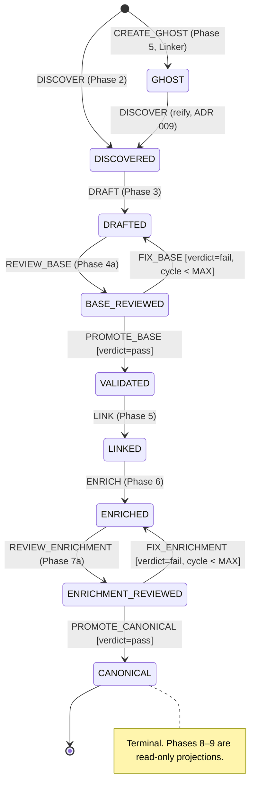

# Pipeline Ledger Contract

The Pipeline Ledger is the **sole sequencing authority** for the Foundry pipeline (ADR 017). This document defines its storage layout, the node lifecycle state machine, the per-phase precondition rules, and the ruling that resolves the immutability-vs-append question. The machine-readable contract lives in `schemas/pipeline_ledger.py`; that module's `TRANSITION_RULES` table is normative — every mutation script must validate against it before executing.

## 1. The Immutability Ruling (ADR 002 vs. "Append")

**ADR 002 governs; the "append" language in ADRs 008 and 015 is logical, never physical.**

1. **Copy-on-write revisions.** Node content lives in immutable files `.skills-data/nodes/<canonical_id>/rev-NNN.<kind>.json`. A phase that "appends" edges or enrichment emits revision N+1 containing the union; revision N is never modified. `NNN` is the per-node ledger sequence that produced the artifact, and every artifact's **sha256 is recorded** as an immutability witness.
2. **Events are canonical; state is derived.** `ledger.jsonl` is an append-only event log — the source of truth. `manifest.json` (current state per node) is a derived cache, rebuildable by folding the log. This is the same doctrine as ADR 014's datastores: derived indexes are disposable.
3. **`taxonomy.py`'s `edges` field** is the shape of a revision's content at rest. The Linker mutates nothing — it emits a new revision with edges populated.
4. **Promotions emit net-new artifacts** (`validated_node`, `canonical_node`), even when content is unchanged from the reviewed revision — uniform application of ADR 002 beats a special case.

## 2. Node Lifecycle State Machine



Any active (non-terminal) state may transition to `QUARANTINED` on fix-cycle exhaustion or validation failure; the Operator may `RELEASE` a quarantined node back to any state present in its own history (mandatory note).

Key mechanics:

- **Fix loops re-review.** A failed gate goes Fixer → back to `DRAFTED`/`ENRICHED` (revision+1, cycle+1) → reviewed again. No AI content enters Canonical without frontier validation (ADR 008).
- **Bounded cycles.** `MAX_FIX_CYCLES_PER_GATE = 2` (constitution: "Not an Agentic Loop"). Exhaustion → `QUARANTINED`; a human decides.
- **Ghost lifecycle (ADR 009).** `CREATE_GHOST` fires from the Linker when an edge targets an absent `canonical_id`, producing a `GhostStub` — a deliberately minimal schema, **not** a `BaseNode` (a stub cannot satisfy `BaseNode`'s required fields). Reification is an ordinary `DISCOVER` from `GHOST`.

## 3. Transition & Precondition Table

| Action | Phase | From → To | Executor | Gate conditions | Produces |
| --- | --- | --- | --- | --- | --- |
| `REGISTER` / `EXTRACT` | 1 | document-level | Extractor (deterministic) | — | `extracted_text` |
| `DISCOVER` | 2 | ∅ or `GHOST` → `DISCOVERED` | Discoverer | source document `EXTRACT`ed | `topic_metadata` |
| `DRAFT` | 3 | `DISCOVERED` → `DRAFTED` | Author | payload validates against `KnowledgeArtifact` | `knowledge_draft` |
| `REVIEW_BASE` | 4a | `DRAFTED` → `BASE_REVIEWED` | Reviewer† | must record `verdict` | `review_report` |
| `PROMOTE_BASE` | 4b | `BASE_REVIEWED` → `VALIDATED` | Fixer | latest verdict = `pass` | `validated_node` |
| `FIX_BASE` | 4b | `BASE_REVIEWED` → `DRAFTED` | Fixer | verdict = `fail` ∧ cycle < MAX | `knowledge_draft` rev+1 |
| `LINK` | 5 | `VALIDATED` → `LINKED` | Linker | edge targets exist or ghosts created | `linked_node` |
| `CREATE_GHOST` | 5 | ∅ → `GHOST` | Linker | target id absent from ledger | `ghost_stub` |
| `ENRICH` | 6 | `LINKED` → `ENRICHED` | Enricher | base ontological fields byte-identical to consumed revision (script diff-check) | `enriched_node` |
| `REVIEW_ENRICHMENT` | 7a | `ENRICHED` → `ENRICHMENT_REVIEWED` | Reviewer† | must record `verdict` | `review_report` |
| `PROMOTE_CANONICAL` | 7b | `ENRICHMENT_REVIEWED` → `CANONICAL` | Fixer | verdict = `pass` | `canonical_node` |
| `FIX_ENRICHMENT` | 7b | `ENRICHMENT_REVIEWED` → `ENRICHED` | Fixer | verdict = `fail` ∧ cycle < MAX | `enriched_node` rev+1 |
| `QUARANTINE` | any | active → `QUARANTINED` | any script / Operator | cycle exhaustion or validation failure | — |
| `RELEASE` | any | `QUARANTINED` → state in node's history | Operator | mandatory `note` | — |

Phases 8–9 (Curation, Rendering) are **read-only projections over `CANONICAL` nodes** — they perform no node-state transitions.

**† Gate reviews are executed by Tier 2 scripts.** A Tier 1 Reviewer agent (`tools: [read, search]`) cannot persist its own Review Report — it has no write and no shell. The formal gate-review transitions (`REVIEW_BASE`, `REVIEW_ENRICHMENT`) are therefore executed by a Tier 2 gate script that invokes the reviewer model as a **tool-less, structured-output API call**, validates the `ReviewReport` schema, persists the artifact, and advances the ledger. This strengthens the guarantee — the reviewing LLM has zero tools, so "structurally forbidden from writing" is absolute (ADR 012; ADR 017 v2 variant b applied early). The Tier 1 Reviewer agent remains available for interactive, exploratory review outside the gates.

## 4. Directory Layout & Atomicity

```
.skills-data/
├── pipeline/
│   ├── ledger.jsonl        # append-only LedgerEvent log — CANONICAL
│   ├── manifest.json       # derived fold of the log — rebuildable, never authoritative
│   └── ledger.lock         # flock; single-writer (ADR 017)
├── extracted/<document_id>/...
└── nodes/<canonical_id>/rev-NNN.<kind>.json
```

**Write protocol (every mutation script):**

1. Acquire `flock` on `ledger.lock`.
2. Validate the requested transition against `TRANSITION_RULES` (state, verdict, fix-cycle, document preconditions). Refuse with a structured error on any violation.
3. Write the produced artifact file(s); compute and record sha256.
4. Append exactly one event line to `ledger.jsonl`; fsync.
5. Rewrite `manifest.json` via temp-file + atomic rename.
6. Release the lock.

A crash between steps 4 and 5 cannot corrupt state: the manifest is rebuilt by folding `ledger.jsonl`. Orphaned artifact files from a crash between 3 and 4 are inert (no event references them) and may be garbage-collected.

## 5. Ratified Judgment Calls

1. **Gate reviews as Tier 2 script API calls** (tool-less structured output) — resolves the Tier 1 persistence impossibility while strengthening "Reviewer cannot rewrite."
2. **`MAX_FIX_CYCLES_PER_GATE = 2`, then quarantine** — and fixes always re-review before promotion.
3. **Promotions emit net-new artifact copies** — uniform ADR 002 over storage thrift.
4. **Strict order `VALIDATED → LINKED → ENRICHED`** — enrichment reads edges (`ontology.md`); no Pass-2 parallelism in v1 despite ADR 008's "asynchronous" wording.
5. **Post-canonical re-ingestion is deferred** — new source material touching a `CANONICAL` node is a v2 concern; the revision lineage supports it later without redesign.
